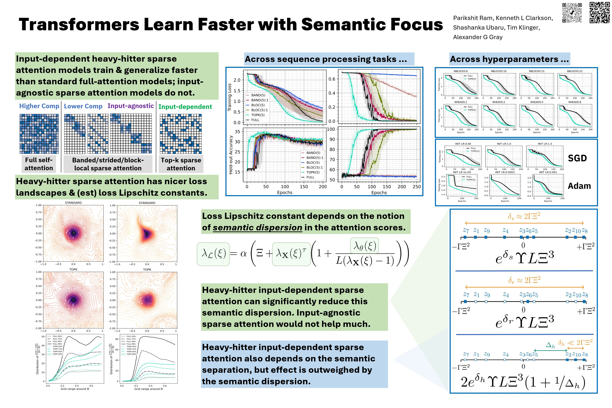

<div align="center">
  
# Transformers Learn Faster with Semantic Focus

</div>

<div align="center">

#### Parikshit Ram<sup>🏢</sup> · Kenneth L. Clarkson<sup>🏢</sup> · Tim Klinger<sup>🏢</sup> · Shashanka Ubaru<sup>🏢</sup> · Alexander G. Gray<sup>🎓</sup>

<sub><sup>🏢</sup> <strong>IBM Research</strong> &nbsp;&nbsp; <sup>🎓</sup> <strong>Centaur AI Institute</strong></sub>

</div>

<div align="center">

📄 **[NeurIPS (PDF)](https://proceedings.neurips.cc/paper_files/paper/2025/file/3035bafea7fdf0ddee585a906dde6a82-Paper-Conference.pdf)**

Preliminary version:

[](https://arxiv.org/abs/2506.14095)

</div>

**Abstract.**
Various forms of sparse attention have been explored to mitigate the quadratic computational and memory cost of the attention mechanism in transformers. We study sparse transformers not through a lens of efficiency but rather in terms of learnability and generalization. Empirically studying a range of attention mechanisms, we find that input-dependent sparse attention models appear to converge faster and generalize better than standard attention models, while input-agnostic sparse attention models show no such benefits -- a phenomenon that is robust across architectural and optimization hyperparameter choices. This can be interpreted as demonstrating that concentrating a model's "semantic focus" with respect to the tokens currently being considered (in the form of input-dependent sparse attention) accelerates learning. We develop a theoretical characterization of the conditions that explain this behavior. We establish a connection between the stability of the standard softmax and the loss function's Lipschitz properties, then show how sparsity affects the stability of the softmax and the subsequent convergence and generalization guarantees resulting from the attention mechanism. This allows us to theoretically establish that input-agnostic sparse attention does not provide any benefits. We also characterize conditions when semantic focus (input-dependent sparse attention) can provide improved guarantees, and we validate that these conditions are in fact met in our empirical evaluations.

## Main results summarized in a poster

<div align="center">
  
</div>

### Environment setup

Assuming CUDA is properly setup on the machine, we will be using python version 3.11

```bash
cd spartan
conda create -n spartan
conda activate spartan
conda install python=3.11 pip>25.0
conda install cudatoolkit -c anaconda  # <== OPTIONAL: if we have access to a GPU
pip install -r requirements.txt
```

### Experimental details

- Data: [data.md](./data.md)
- Training runs: [train.md](./train.md)
- Figures: [pltcmds.md](./pltcmds.md)

## Citing this work

```
@article{ram2025transformers,
  title={Transformers Learn Faster with Semantic Focus},
  author={Ram, Parikshit and Clarkson, Kenneth and Klinger, Tim and Ubaru, Shashanka and Gray, Alexander},
  journal={Advances in Neural Information Processing Systems},
  volume={38},
  pages={33438--33502},
  year={2025}
}
```
